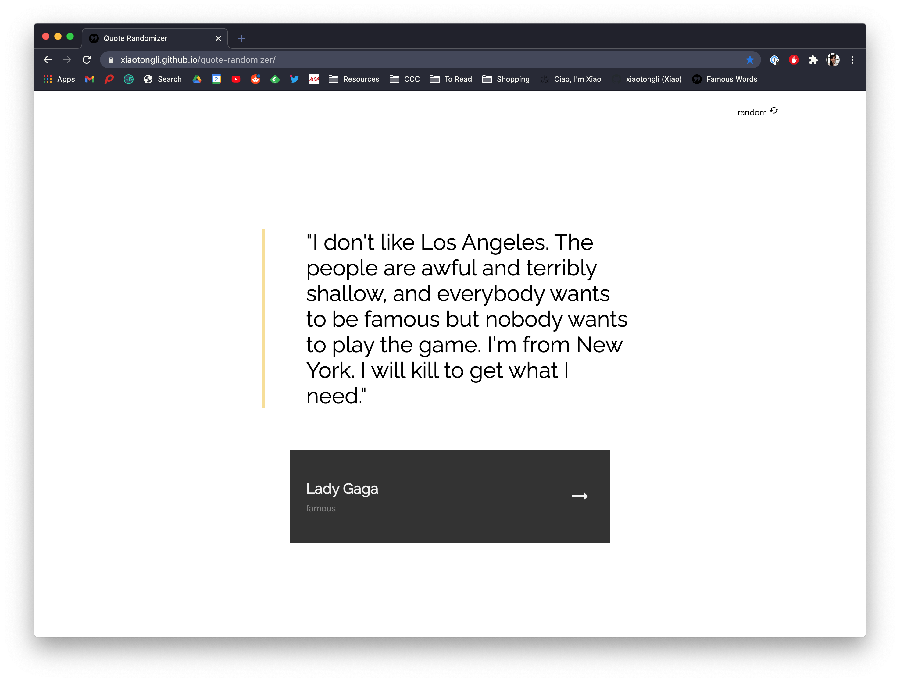

# Quote Randomizer

My first challenge from the Front-End Developer challenge path of [Devchallenges.io](http://devchallenges.io).

## Web App Description

The [challenge](https://devchallenges.io/challenges/8Y3J4ucAMQpSnYTwwWW8) was to build a quote generator application that fulfills the following user stories below:
- I can see a random quote
- I can generate a new random quote
- I can see the quote genre under the author
- When I select the quote's author, I can see a list of quotes from them

A set of designs in Figma was also provided as a challenge and resource. 

This project can be viewed at this [link](https://xiaotongli.github.io/quote-randomizer/).

This is my first time working with an API and there are still some refactoring and feature ideas I'd like to implement:
- Use a front-end framework like React or Vue.js
- Use Tailwind CSS to polish up current css styling
- Filters to allow for the selection of a particular genre or author
- Viewing multiple pages of quotes from a single author
- Allow for users to add a quote to their favorites
- General text aligning updates

## Technologies

Project is created with: 
- Not yet: [React](https://reactjs.org/)
- Not yet: [Vue.js](https://vuejs.org/)
- Not yet: [Tailwind](https://tailwindcss.com/)
- [Quote-Garden API](https://pprathameshmore.github.io/QuoteGarden/)
- [Material Design Icons](https://google.github.io/material-design-icons/)
